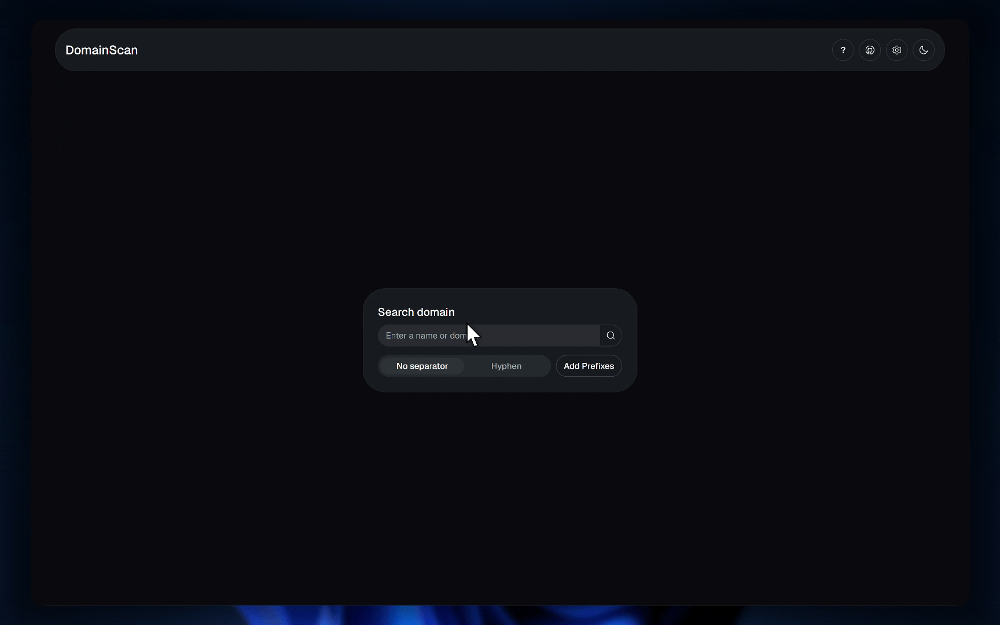

# DomainScan

Generate domain name ideas and check availability and prices for your next idea.



[**Try it**](https://domainscan.robertlupas.workers.dev/)

## Quick Start

### Run locally

Add your Cloudflare tokens (`CLOUDFLARE_ACCOUNT_ID` and `CLOUDFLARE_API_TOKEN`) to a `.env` file in the root of the project.

```bash
bun install
bun dev
```

## Features

- Generate domain name ideas by adding prefixes, suffixes and separators (between multiple names) to your base idea
- Check availability and prices for generated domain names using the Cloudflare Registrar API
- Save domain names for later reference

## Tech Stack

- [Tanstack](https://tanstack.com/) - Start, Router, and React Query
- [Cloudflare TypeScript API Library](https://www.npmjs.com/package/cloudflare) - Domain availability and pricing API (using the Cloudflare Registrar)
- [tldts](https://www.npmjs.com/package/tldts) - Parse and validate domain names